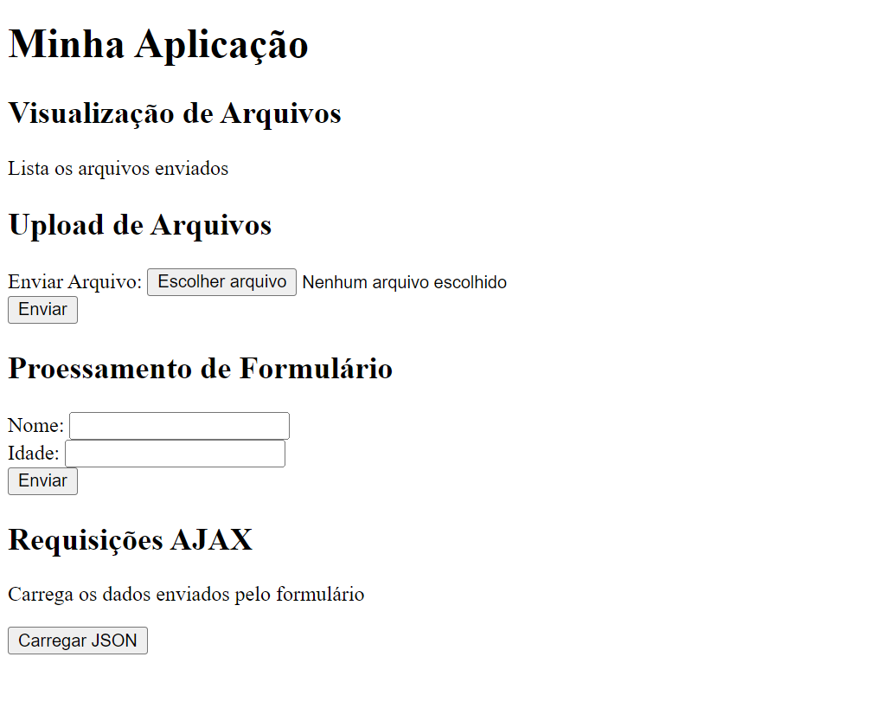
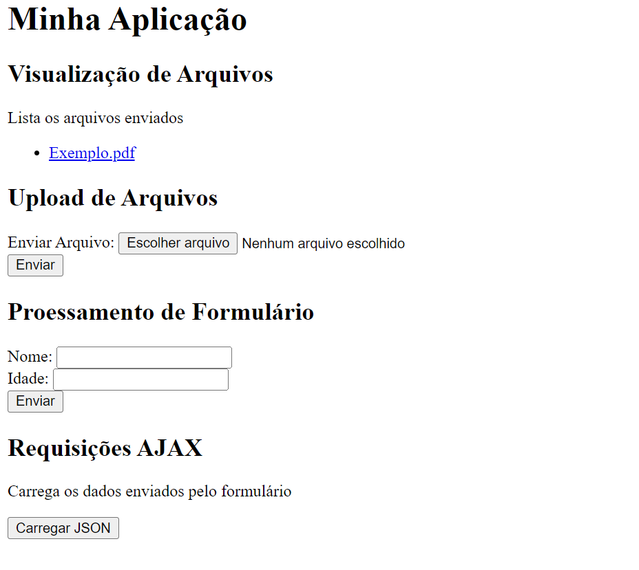
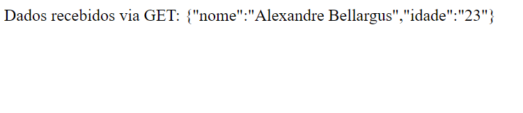
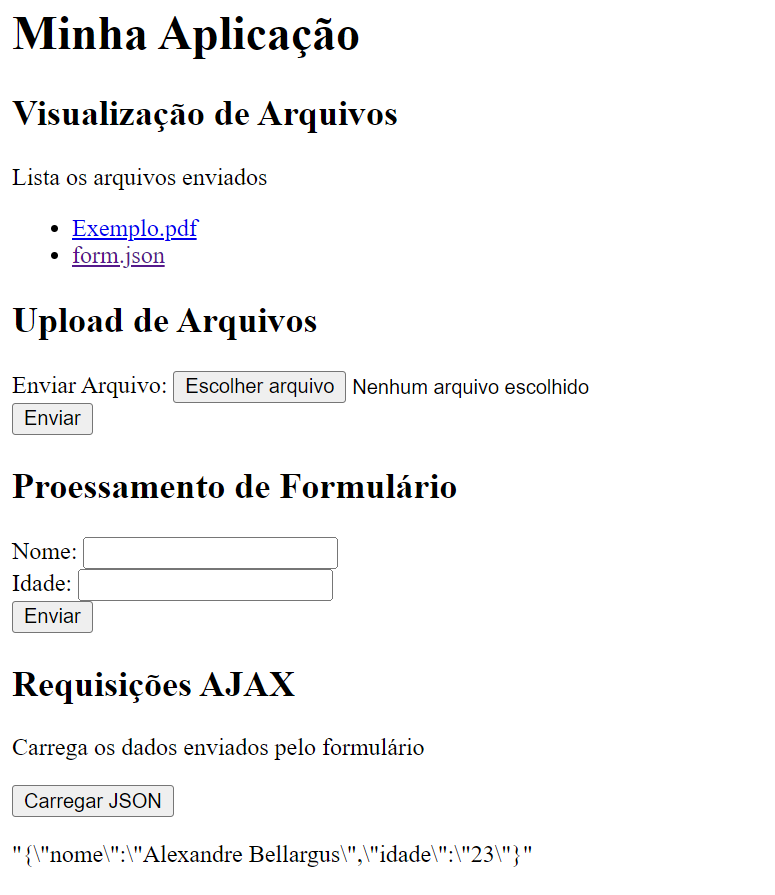

# Atividade 4 - CES-26
## Aluno: Alexandre Bellargus

### Aplicativo ao iniciar

### Aplicativo ao fazer um upload de um arquivo

### Aplicativo ao enviar um formulário

### Aplicativo após requisitar um json

### Considerações
Eu tentei hospedar em vercel no seguinte link: https://atv4.vercel.app/ mas não consegui fazer funcionar o upload de arquivos.